# VisitFlow 사용자 가이드

VisitFlow v2.7.3 기준. 화면을 띄워 놓고 지키는 사람을 위한 설치·설정·운영 절차는 [관리자 가이드](ADMIN_GUIDE.md)에 있다.

## 1. 이 제품이 하는 일

VisitFlow는 회사에 오는 손님을 맞는 일을 한 흐름으로 묶는다. 담당자가 방문을 신청하면 필요한 경우 승인을 거쳐 방문자마다 QR 방문증이 발급되고, 로비에서 그 QR을 읽어 입실·퇴실을 처리하며, 담당자에게는 도착 알림이 간다. 누가 언제 들어와서 언제 나갔는지는 감사 기록으로 남는다.

세 부류의 사람이 쓴다. **방문 요청자**(손님을 부르는 임직원)는 방문 신청과 내 방문 일정 화면을, **로비 담당자**는 Lobby Dashboard·QR Scan·비상 대피 명단을, **승인자**(부서 관리자·보안 담당자)는 방문 승인 화면을 쓴다. 방문자 본인은 로그인 없이 문자로 받은 모바일 방문증과 사전등록 링크만 연다.

인터넷이 끊긴 사내망에서도 동작하도록 만들어졌다. 화면·글꼴·QR 생성이 모두 서버 안에서 처리되며, 비상 대피 명단은 서버가 끊겨도 마지막으로 받은 명단을 연다.

## 2. 처음 5분 — 로그인부터 방문증 발급까지

1. 관리자에게 받은 주소(예: `http://visit.company.intra:8080`)를 열고 아이디와 비밀번호를 입력한 뒤 `로그인`을 누른다. Keycloak SSO가 켜진 환경이면 `Keycloak SSO로 계속` 버튼이 함께 보인다.

   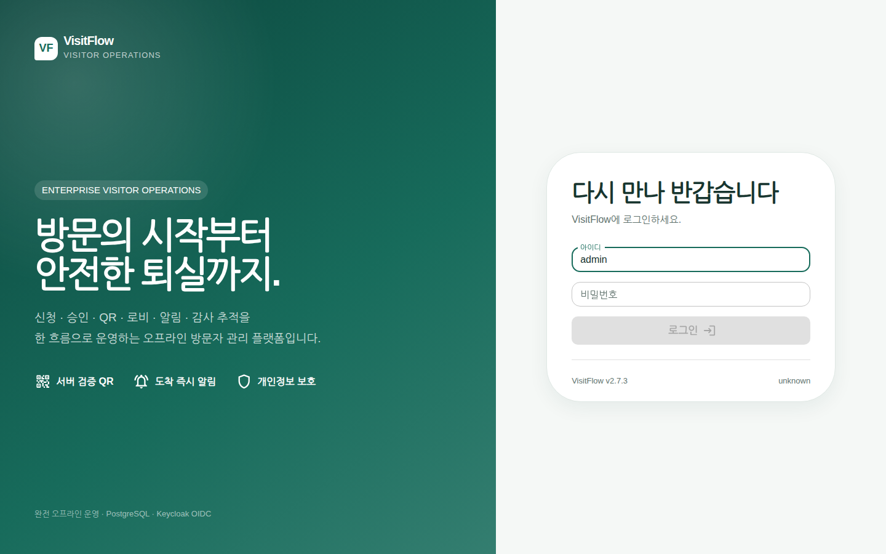

2. 로그인하면 **Dashboard**가 열린다. 오늘 방문 예정·예정 방문·도착 방문중·승인 대기 수와 오늘 방문 목록이 한눈에 보인다. 오른쪽 위 `방문 신청`을 누른다.

   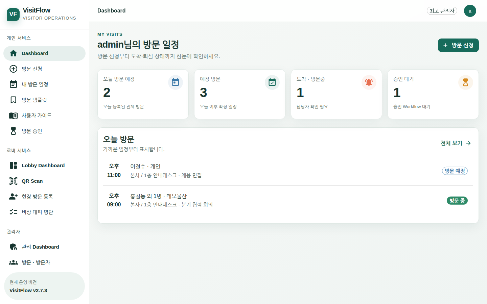

3. **방문 신청** 화면에서 사업장·로비·방문 시작·종료·방문 목적을 채우고, 방문자 1의 이름·휴대전화·회사명을 입력한다. 개인정보 동의 확인란(`방문자 개인정보 수집·이용 동의를 확인했습니다.`)을 켜고 `방문 신청 제출`을 누른다.

   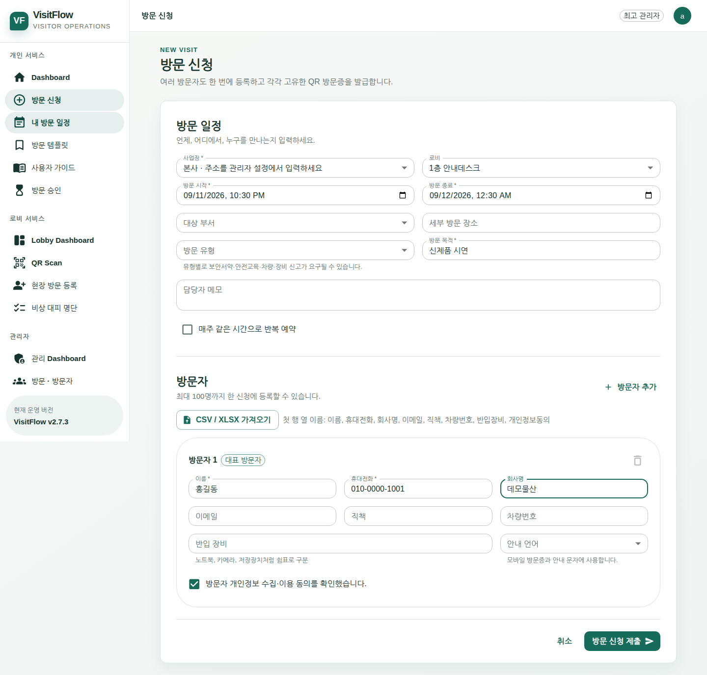

4. `방문 등록 완료` 화면에 방문자별 모바일 방문증 링크(`…/q/vfq_…`)가 표시된다. 승인이 필요 없는 방문은 즉시 확정되고, 관리자가 문자 발송 규칙을 켜 두었다면 방문자에게 이 링크가 문자로 간다.

5. 방문자가 링크를 열면 **모바일 방문증**이 보인다. 앱 설치 없이 QR·장소·시간·담당자와 현재 상태를 보여 주고, 오른쪽 위에서 언어를 바꿀 수 있다. 로비에서 이 QR을 제시하면 체크인된다.

   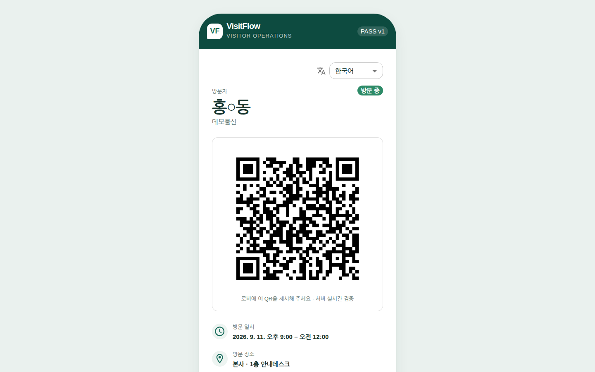

## 3. 화면별 사용법

### 3.1 Dashboard

`내 방문 일정`의 요약이다. 네 개의 타일(오늘 방문 예정·예정 방문·도착 방문중·승인 대기)과 가까운 순서의 오늘 방문 목록을 보여 주며, `전체 보기`를 누르면 내 방문 일정으로 간다. 승인자는 왼쪽 메뉴에 `방문 승인`이 추가로 보인다.

### 3.2 방문 신청

한 신청에 방문자를 최대 100명까지 넣을 수 있다.

- **방문 일정**: 사업장·로비·시작·종료(한 방문은 31일을 넘길 수 없다)·대상 부서·세부 방문 장소·방문 유형·방문 목적·담당자 메모. `매주 같은 시간으로 반복 예약`을 켜면 `총 예약 횟수`(2~52회)만큼 같은 요일·시간으로 만들어진다.
- **방문 유형**: 유형에 따라 `방문자에게 보안서약 내용을 안내하고 확인받았습니다.`, `방문자의 안전교육 이수를 확인했습니다.` 확인란과 차량번호·반입 장비 입력이 필수가 된다. 일부 유형은 전역 정책과 무관하게 항상 승인을 거친다(예: 기본 제공되는 `협력사 작업`).
- **방문자**: `방문자 추가`로 한 명씩 넣거나 `CSV / XLSX 가져오기`로 첫 시트를 읽어 온다. 첫 행 열 이름은 `이름, 휴대전화, 회사명, 이메일, 직책, 차량번호, 반입장비, 개인정보동의`이며 파일은 6MB 이하여야 한다. 방문자별 `안내 언어`를 지정하면 모바일 방문증과 안내 문자가 그 언어로 나간다.
- 제출 후 자동 승인 정책이면 즉시, 승인 정책이면 승인 후 방문자별 QR이 발송된다.

### 3.3 내 방문 일정

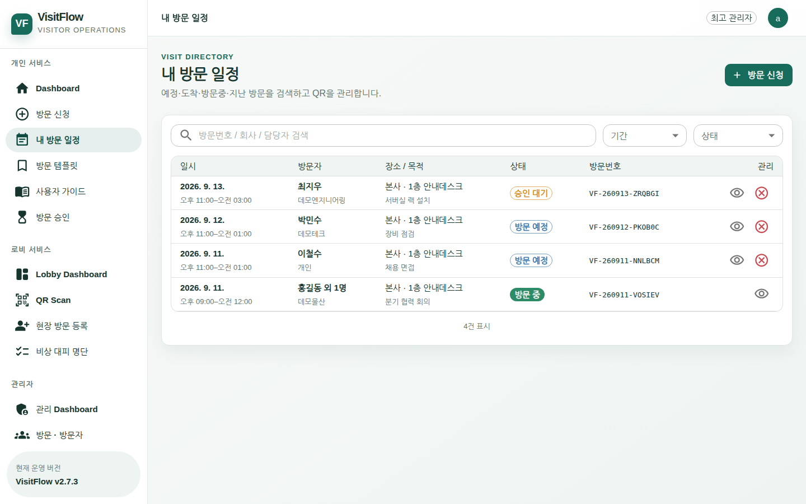

내가 담당자인 방문을 상태·기간으로 걸러 본다. 목록이 길면 `더 보기`로 이어서 조회한다. 행의 `상세`를 누르면 방문자 명단과 진행 기록이 열린다.

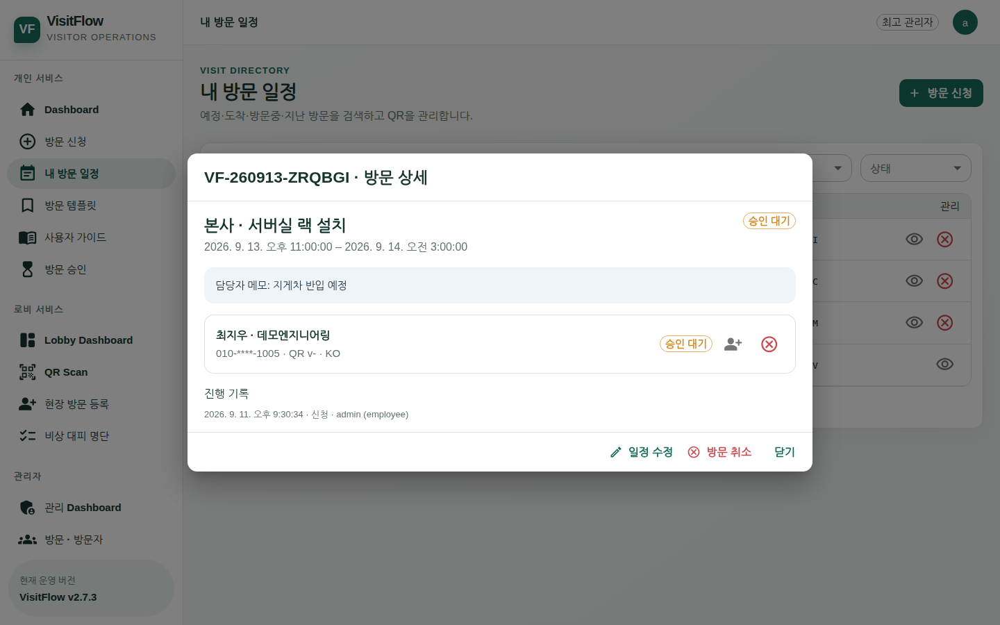

상세 화면에서 할 수 있는 일:

- **일정 수정** — 시작·종료·목적·장소를 바꾸면 발급된 QR의 유효기간과 예약 알림이 함께 갱신된다.
- **취소** — 방문 전체를 취소한다. 단체 방문은 방문자 한 명만 취소할 수도 있고, 매주 반복 일정은 해당 회차부터 이후를 한 번에 취소한다.
- **QR 재발급** — 방문자가 링크를 잃었거나 유출이 의심될 때. 이전 QR은 즉시 폐기된다.
- **방문 안내 재발송** — 확정된 방문의 안내 문자를 다시 보낸다.
- **방문자 사전등록 링크** — 방문자 정보를 본인이 입력하게 한다(3.11절). 방문자가 완료하면 `본인 사전등록 완료`로 표시된다.
- 승인·반려 사유가 있으면 상세 화면에 그대로 보인다.

### 3.4 방문 템플릿과 자주 방문자

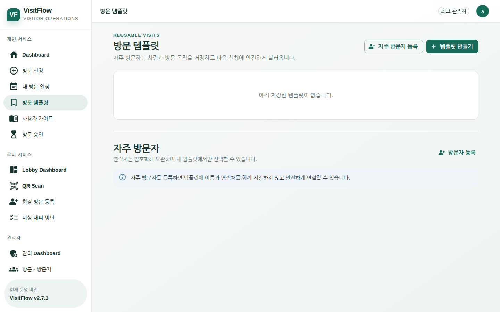

1. 자주 방문자에서 이름·연락처와 개인정보 동의 여부를 저장한다.
2. 템플릿을 만들거나 수정할 때 필요한 자주 방문자를 선택한다.
3. `이 템플릿으로 신청`을 누르면 최신 자주 방문자 정보가 신청서에 채워진다. 템플릿에는 개인정보 원문 대신 자주 방문자 ID만 연결된다.
4. 더 이상 쓰지 않는 자주 방문자는 직접 삭제할 수 있고 모든 템플릿 연결도 함께 제거된다. 직접 삭제하지 않아도 마지막 템플릿 사용 후 관리자가 정한 개인정보 파기 기간이 지나면 자동 삭제된다.

### 3.5 사용자 가이드 게시판

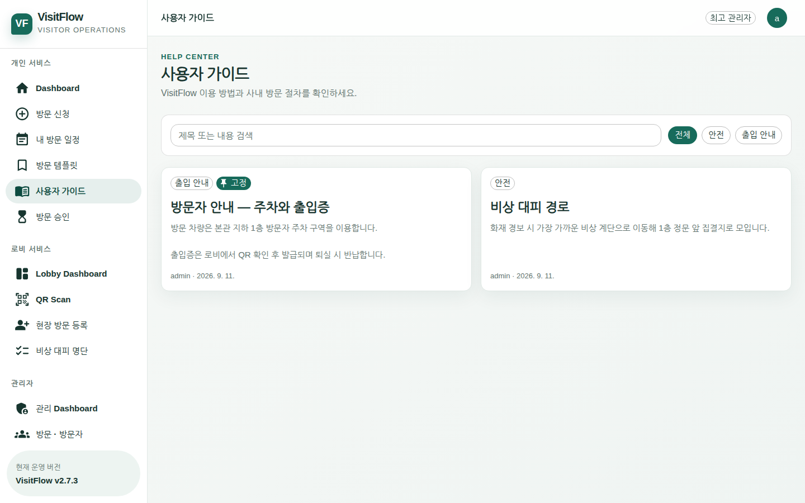

왼쪽 메뉴의 `사용자 가이드`에서 관리자가 게시한 최신 운영 안내(주차, 출입증 반납, 비상 대피 경로 등)를 확인한다. 초안 상태의 글은 관리자에게만 보인다.

### 3.6 방문 승인 (승인자)

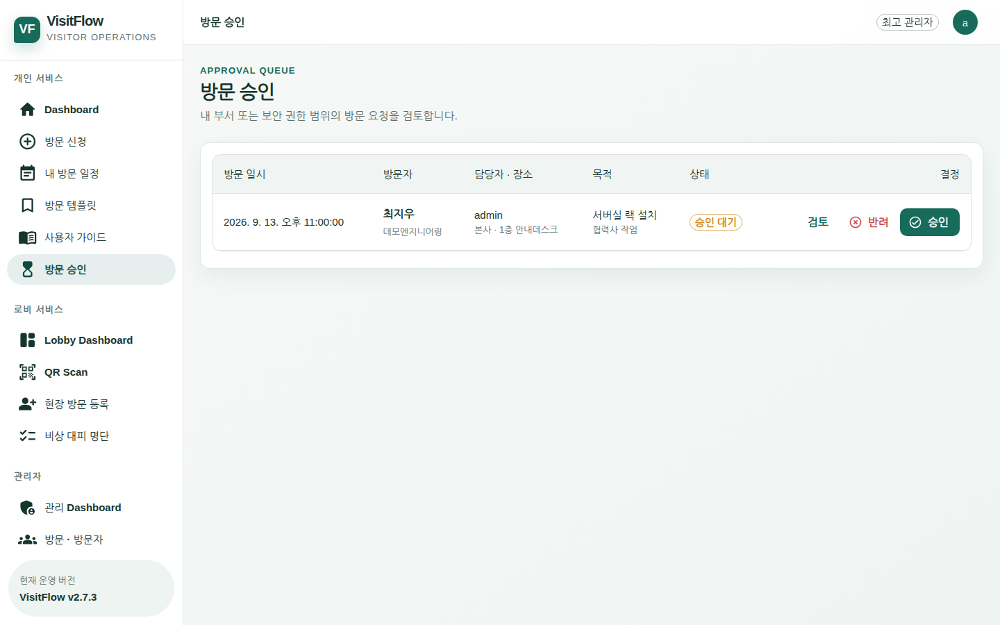

부서 관리자는 소속 부서의 방문을, 보안 담당자·관리자는 전체 승인 대기 방문을 본다. 각 행에서 바로 `승인`·`반려`할 수 있고, `검토`를 누르면 방문자 명단(회사·직책·차량·반입 장비·동의 주체)과 담당자 메모를 확인한 뒤 결정할 수 있다.

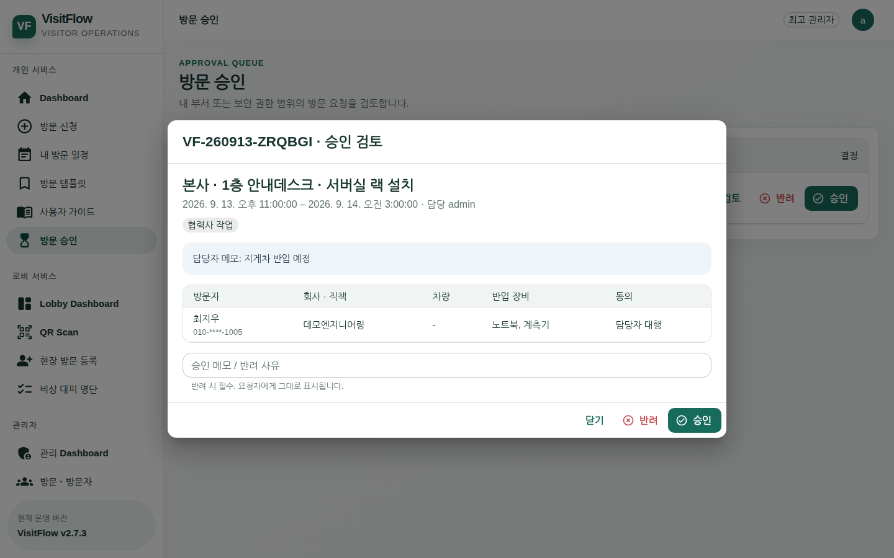

반려 시 사유는 필수이며 요청자 화면에 그대로 표시된다. 관리자가 `방문 반려 시` 발송 규칙을 두었으면 담당자에게 문자로도 간다. 승인 대기가 관리자가 정한 시간을 넘기면 승인 지연 알림이 한 번 발생한다.

### 3.7 Lobby Dashboard (로비 담당자)

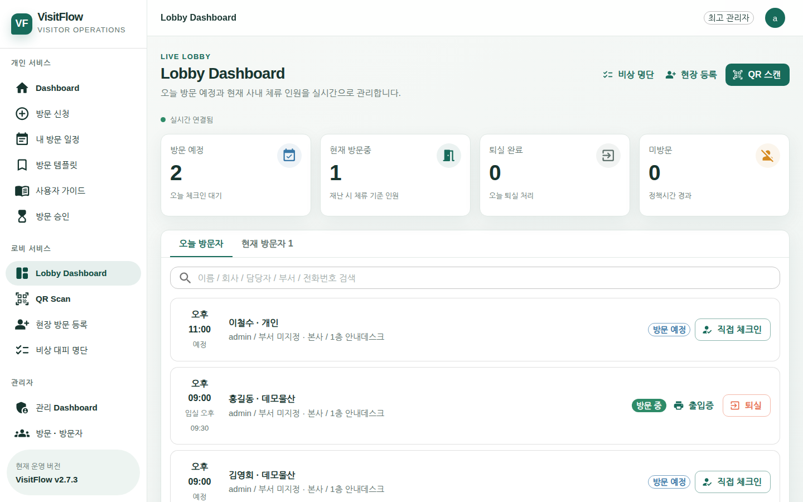

오늘 예정자와 현재 체류 인원을 실시간으로 본다(`실시간 연결됨` 표시). `오늘 방문자`·`현재 방문자` 탭과 이름/회사/담당자/부서/전화번호 검색이 있고, 로비가 여러 개인 사업장은 `로비` 필터로 화면을 나눈다. 담당 사업장이 지정된 로비 담당자는 그 사업장의 로비와 방문증만 처리할 수 있다.

- **직접 체크인** — 방문자가 QR을 제시할 수 없을 때(휴대폰 방전 등). `신분 확인 방법 / 사유`를 적고 입실 처리하면 해당 방문자의 QR은 사용 처리된다. 예정 상태의 방문자만 가능하다.
- **출입증** — 방문 중인 방문자의 인쇄용 출입증을 출력한다.
- **퇴실** — 현재 방문자 목록에서 퇴실 처리한다.

### 3.8 QR Scan (로비 담당자)

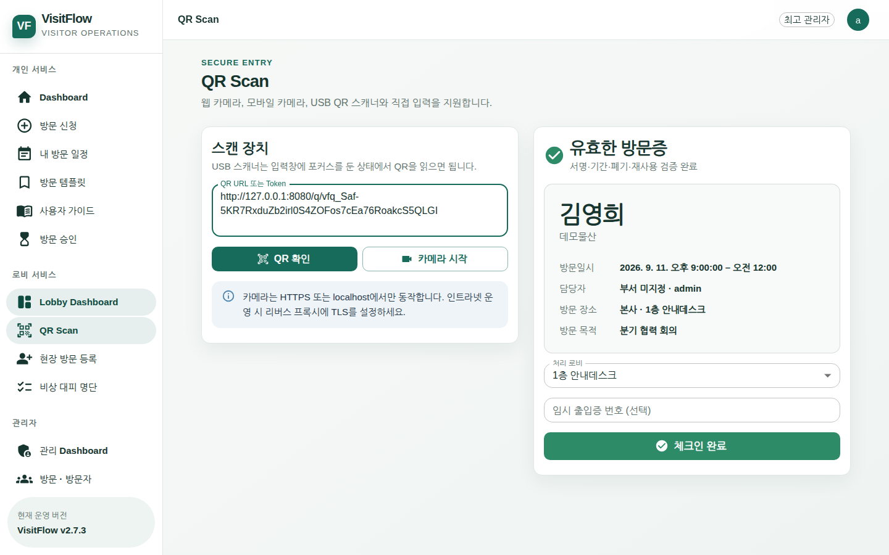

세 가지 방법으로 방문증을 검증한다.

1. **USB 스캐너** — `QR URL 또는 Token` 입력창에 포커스를 둔 상태에서 QR을 읽는다. 스캐너가 Enter까지 입력하므로 곧바로 검증된다.
2. **카메라** — `카메라 시작`. HTTPS 또는 localhost에서만 동작한다.
3. **직접 입력** — 방문증 URL이나 토큰을 붙여 넣고 `QR 확인`.

`유효한 방문증`이 뜨면 방문자·담당자·장소를 확인하고, 필요하면 `임시 출입증 번호 (선택)`를 입력한 뒤 `체크인 완료`를 누른다. 체크인 즉시 담당자 알림이 발송 대기열에 들어간다.

### 3.9 현장 방문 등록 (로비 담당자)

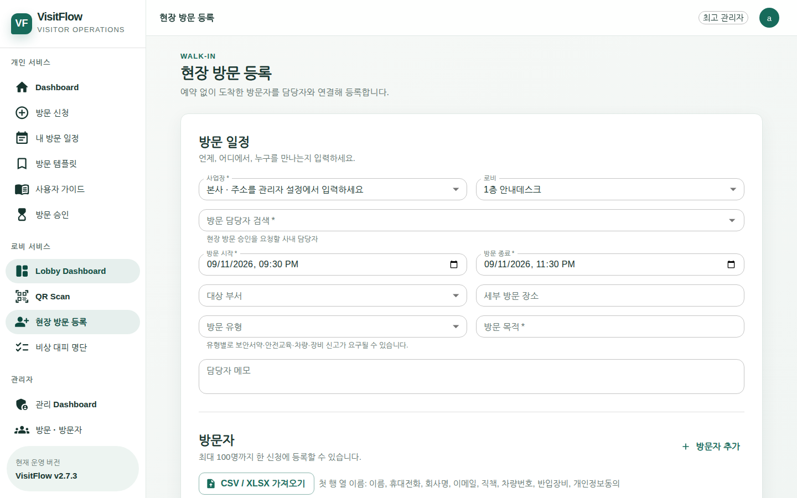

예약 없이 온 방문자를 로비에서 등록한다. 방문 신청과 같은 양식에 `방문 담당자 검색`으로 담당자를 연결하며, 등록과 동시에 체크인된다.

### 3.10 비상 대피 명단 (로비 담당자)

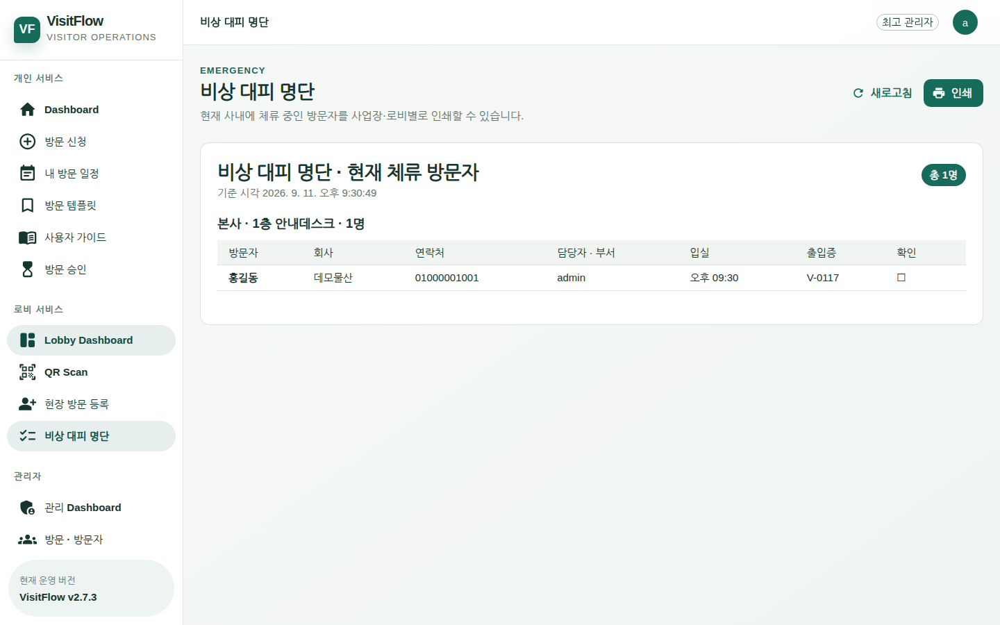

현재 체류 중인 방문자를 사업장·로비별로 확인하고 인쇄한다. 화면은 마지막으로 받은 명단을 브라우저에 보관하므로 네트워크나 서버가 끊겨도 직전 명단이 열리며, 이때는 오프라인 상태임을 함께 표시한다.

### 3.11 방문자 셀프 사전등록 (방문자 본인)

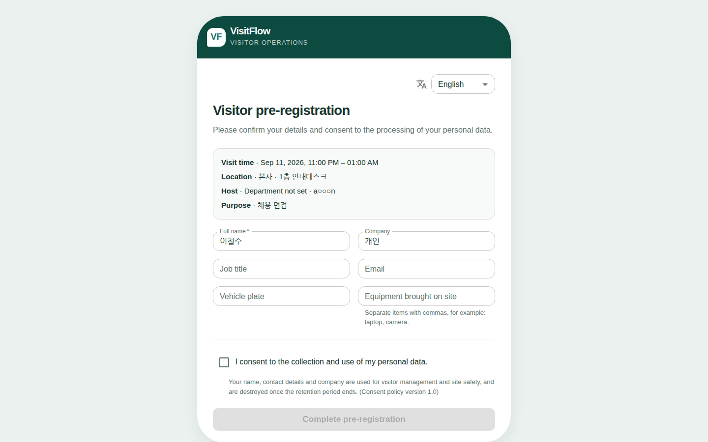

담당자가 방문 상세에서 발급한 링크(`…/r/…`)를 방문자가 열어 정보를 채우고 개인정보 수집·이용에 본인이 동의한다. 링크는 관리자가 정한 시간 동안만 유효하고 한 번 완료되면 다시 쓸 수 없다. 화면 언어는 방문자의 안내 언어를 따르며 오른쪽 위에서 바꿀 수 있다.

### 3.12 무인 키오스크

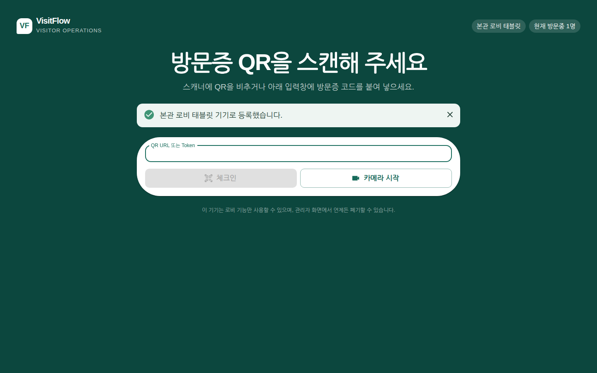

관리자에게 받은 키오스크 링크를 태블릿에서 한 번 열면 등록이 끝나고, 이후에는 로그인 없이 `방문증 QR을 스캔해 주세요` 화면만 사용한다. 방문자가 QR을 읽히면 `체크인되었습니다` 안내가 뜬다.

### 3.13 프로필 메뉴와 내 API 키

오른쪽 위 아바타를 누르면 프로필 메뉴가 열린다.

- **휴대전화** — 방문자 도착 알림 수신에 쓴다. 새 번호를 입력할 때만 바뀌고, 비워 두면 기존 번호가 유지되며 삭제는 `등록된 연락처 삭제`를 선택해야 한다.
- **메일 알림** — 방문자 도착·퇴실, 방문 확정·반려·취소, (승인자라면) 승인 대기·지연 중 받을 항목을 고른다. 관리자가 SMTP를 켜고 계정에 이메일이 등록되어 있어야 발송된다.
- **대리 담당자** — 휴가 등으로 자리를 비울 때 대리 담당자와 종료 시각을 지정한다. 그 기간의 승인과 도착 알림은 대리 담당자에게 간다(최대 1년).
- **비밀번호 변경** — 로컬 계정만. 12자 이상이어야 한다. SSO 계정은 Keycloak에서 바꾼다.

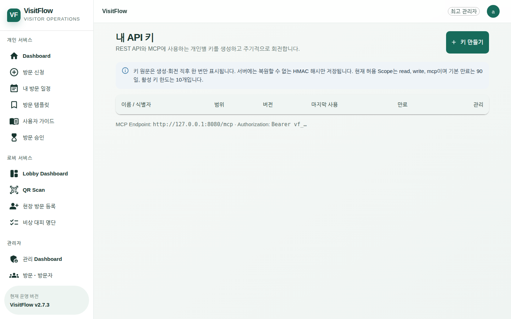

`내 API 키`에서는 관리자가 허용한 `read`, `write`, `mcp` 범위를 키별로 선택한다. 원문은 생성·회전 직후 한 번만 표시되므로 Password Vault에 보관한다. 주기적으로 회전하고 더 이상 쓰지 않는 키는 즉시 폐기한다. API 사용법은 [API 및 MCP](API_AND_MCP.md)를 본다.

## 4. 자주 하는 작업

**협력사 열 명을 한 번에 신청하기** — 엑셀에서 첫 행을 `이름, 휴대전화, 회사명, 이메일, 직책, 차량번호, 반입장비, 개인정보동의`로 만들고 CSV 또는 XLSX로 저장한다. 방문 신청 → `CSV / XLSX 가져오기`로 불러온 뒤 미리보기에서 경고(전화번호 자릿수, 동의 누락)를 확인하고 제출한다.

**매주 오는 업체 등록하기** — 방문 신청에서 `매주 같은 시간으로 반복 예약`을 켜고 `총 예약 횟수`를 넣는다. 중간에 그만두면 내 방문 일정 → 상세에서 해당 회차부터 이후를 한 번에 취소한다.

**방문자 정보를 방문자가 직접 채우게 하기** — 이름과 휴대전화만으로 신청한 뒤 상세 → `방문자 사전등록 링크`를 만들어 전달한다. 완료되면 `본인 사전등록 완료`가 표시된다.

**방문자가 QR 링크를 잃어버렸을 때** — 상세 → `QR 재발급`. 이전 QR은 즉시 무효가 되며 새 링크가 발송된다. 링크는 있는데 문자를 못 받았다면 `방문 안내 재발송`.

**휴가 중 승인이 밀리지 않게 하기** — 프로필 메뉴에서 대리 담당자와 종료 시각을 지정한다. 부서 관리자가 지정한 대리자는 그 부서의 승인 대기 방문을 승인·반려할 수 있다.

**로비에서 QR 없이 들여보내기** — Lobby Dashboard → 오늘 방문자 → `직접 체크인`. 신분 확인 방법을 적어야 하며 감사 기록에 남는다.

**대피 훈련·비상 시 명단 뽑기** — 비상 대피 명단 → 인쇄. 서버가 끊겨도 직전 명단이 열린다.

## 5. 막혔을 때

| 화면에 보이는 문구 | 뜻과 조치 |
|---|---|
| `아이디 또는 비밀번호를 확인하세요` | 로컬 계정 정보가 틀렸다. `비밀번호를 잊으셨나요?`로 재설정 링크를 받거나(메일이 켜진 경우) 관리자에게 `비밀번호 초기화`를 요청한다. |
| `로그인 시도가 많아 N분 동안 잠겼습니다` | 실패 횟수가 한도를 넘어 잠겼다. 표시된 시간 뒤 다시 시도한다. 급하면 관리자의 `비밀번호 초기화`가 잠금을 함께 푼다. |
| `임시 비밀번호를 새 비밀번호로 변경해야 계속 사용할 수 있습니다` | 관리자가 발급한 임시 비밀번호로 로그인했다. 안내 화면에서 12자 이상의 새 비밀번호를 정해야 다른 기능이 열린다. |
| `세션이 만료되었습니다` | 다시 로그인한다. 관리자가 세션을 종료했거나 세션 유효 시간이 지났다. |
| `일정과 방문 목적을 확인하세요` | 종료가 시작보다 앞서거나 목적이 비었다. |
| `한 방문 일정은 31일을 초과할 수 없습니다` | 기간을 줄이거나 반복 예약으로 나눈다. |
| `방문자 이름, 휴대전화, 개인정보 동의는 필수입니다` / `회사명은 현재 정책상 필수입니다` | 방문자마다 이름·휴대전화·동의 확인이 있어야 하고, 관리자가 `회사명 필수`를 켠 환경에서는 회사명도 비울 수 없다. |
| `개인정보 수집·이용 동의가 필요합니다` | 방문자마다 동의 확인란을 켜거나, 사전등록 링크로 방문자 본인이 동의하게 한다. |
| `보안서약 확인이 필요합니다` / `안전교육 이수 확인이 필요합니다` / `차량번호를 입력하세요` / `반입 장비를 입력하세요` | 선택한 방문 유형이 요구하는 항목이다. 채우거나 유형을 바꾼다. |
| `보안 정책에 따라 방문 등록을 완료할 수 없습니다. 보안 담당자에게 문의하세요` | 방문자의 전화번호나 회사가 Watch List에 있다. 담당자가 풀 수 없다 — 보안 담당자에게 넘긴다. |
| `CSV/XLSX 파일은 6MB 이하여야 합니다` / `가져올 CSV 또는 XLSX 파일을 선택하세요` | 파일을 나누거나 다시 선택한다. |
| `방문 가능 시간대가 아닙니다` (로비) | 조기 체크인 허용 시간보다 이르거나 방문이 끝났다. 시간을 확인하고, 필요하면 담당자가 일정을 수정한다. |
| `이미 체크인에 사용된 방문증입니다` (로비) | 1회 사용 QR이 이미 쓰였다. 재사용 시도이거나 방문자가 두 번 찍은 것이다. 현재 방문자 목록에서 확인한다. |
| `갱신된 QR을 다시 스캔하세요` (로비) | Dynamic QR 주기가 지나 화면의 QR이 바뀌었다. 방문자에게 화면을 새로 고쳐 달라고 한다. |
| `체크인할 수 없는 방문증입니다` (로비) | 취소·반려·폐기된 QR이다. 담당자에게 재발급을 요청한다. |
| `담당 사업장이 아닌 방문입니다` (로비) | 다른 사업장의 방문증이다. 그 사업장 로비로 안내한다. |
| `예정 상태의 방문자만 직접 체크인할 수 있습니다` | 이미 입실했거나 종료·취소된 방문자다. |
| `카메라는 HTTPS 또는 localhost에서만 동작합니다` | 브라우저 제한이다. USB 스캐너나 직접 입력을 쓰고, 관리자에게 리버스 프록시 TLS 설정을 요청한다. |
| `취소할 수 없는 방문 상태이거나 권한이 없습니다` | 이미 입실했거나 종료된 방문이거나, 내가 담당자·대리자가 아니다. |
| `QR을 재발급할 수 없는 방문 상태입니다` / `종료·취소·반려 또는 미방문 처리된 방문자는 QR을 재발급할 수 없습니다` | 새 방문을 신청한다. |
| `요청이 너무 많습니다. 잠시 후 다시 시도하세요` | 공개 화면(방문증·사전등록)의 분당 요청 한도에 걸렸다. 잠시 기다린다. |
| `관리자가 허용한 키 범위만 선택할 수 있습니다` / `활성 개인 키 한도에 도달했습니다` | API 키 정책은 관리자가 정한다. 안 쓰는 키를 폐기하거나 관리자에게 범위 허용을 요청한다. |
| `유효한 모바일 방문증을 찾을 수 없습니다` (방문자) | 링크가 만료·폐기됐다. 담당자에게 재발급을 요청한다. |

## 6. 용어

- **대표 방문자** — 한 신청의 첫 번째 방문자. 목록에는 `홍길동 외 1명`처럼 대표 방문자 이름으로 표시된다.
- **모바일 방문증** — 방문자가 문자로 받는 `…/q/vfq_…` 링크. QR과 방문 정보를 보여 주며 개인정보는 담지 않는다.
- **1회 사용 QR / Dynamic QR** — 관리자 정책에 따라 QR은 한 번 체크인하면 폐기되고, Dynamic 주기가 켜져 있으면 일정 시간마다 화면의 QR이 바뀐다.
- **사전등록 링크** — 방문자 본인이 정보를 입력하고 동의하는 `…/r/…` 링크. 한 번 완료되면 다시 쓸 수 없다.
- **직접 체크인** — QR 없이 로비 담당자가 신분 확인 방법을 기록하고 입실 처리하는 것.
- **미방문** — 방문 종료 시각에 유예 시간을 더해도 체크인하지 않은 방문. 자동으로 표시된다.
- **자동 퇴실** — 관리자가 정한 시각(사업장 현지 시각)에 퇴실 처리되지 않은 방문자를 정리하는 것.
- **대리 담당자** — 부재 기간 동안 내 방문의 승인·취소·재발급·도착 알림을 대신 받는 사람.
- **Watch List** — 보안 담당자가 등록한 출입 제한 전화번호·회사. 해당 방문자는 신청 단계에서 막힌다.
- **방문 유형** — 관리자가 정의한 방문 분류. 유형별로 보안서약·안전교육·차량·반입 장비 필수 여부와 승인 강제가 정해진다.
